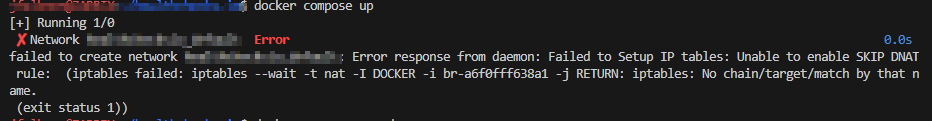

# Docker Behavior with `firewalld`

Docker and the firewall have to work in harmony I've found. If the firewall gets enabled/disabled,  docker needs to restart as well for it to properly adjust to the changes

It will throw error like this if you attempt to start the container without first restarting the docker service



## Case Study

Let's say you currently have your `firewalld` enabled and have started a few containers. You then choose to disable your firewall with

```bash
systemctl stop firewalld
```

Attempting to restart your previous containers - with something like `docker compose restart` - will result in the error shown in image in the introduction. First, we must restart the docker service:

```bash
# restart docker service AFTER you've stopped firewalld
systemctl restart docker

# now try the docker commands again
docker compose down
docker compose up -d
```

You must follow the same process when/if you re-enable `firewalld`.
