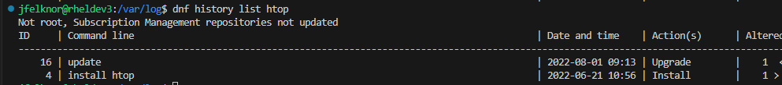
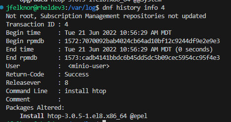

# DNF History

It can be very helpful to inspect `dnf` logs and records to get a better idea on when a certain package was last updated, what versions were installed, etc.

## Inspect DNF log

`dnf` maintains a log at `/var/log/dnf.log` and `/var/log/dnf.rpm.log`. The `dnf.rpm.log` variant appears to be more focused on install/upgrade events, and less so on other `dnf` activity, like cache refreshes. The simplest way of checking in on the history of installations/updates is to `grep` this log. For example, you may be wondering when the last time a package was upgraded, you could do

```bash
# show upgrades
grep "Upgrade" /var/log/dnf.rpm.log 

# Show installs
grep "Installed" /var/log/dnf.rpm.log
```

## Use DNF History

An alternative, which may be more insightful depending on your needs, would be to use the `dnf history` command. The best way to find out the history of a package is to use

```bash
dnf history list <package_name>
```

For example, I could check when I installed `htop` on a particular system

```bash
dnf history list htop
```

and may get an output like



From here, I can see that I first installed `htop` on `2022-06-21`, and it has been upgraded once since on `2022-08-01`.

If I wanted even more details on the transaction that installed a particular package, I could use the `dnf history info <history_id>` command, specifying the ID in the leftmost column from the output above. For example,

```bash
dnf history info 4
```



From this output, I can see the user that triggered the install (`minio-user` in this case, weird...), when it started and finished, which packages were altered and their versions, the return code, and even the command line options given to `dnf` that triggered the install. The command line value may be missing if this update was triggered via another method rather than manually typing the command, like when updates are applied via Ansible.
