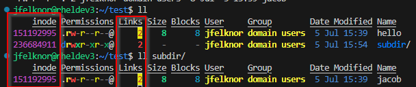
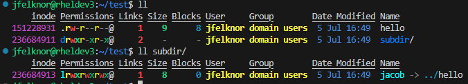

# Filesystem Links

Sometimes it is useful to create filesystem links so that a certain file or directory can be referenced or used from multiple locations on the filesystem. There are two types of links: hard links and symbolic links (sometimes called "symlinks" or "soft links").

## Hard Links

Hard links create a brand new pointer to the inode for the file. An inode is a data structure in a Unix-style file system that describes a filesystem object such as a file or a directory. Each inode stores the attributes and disk block locations of the object's data. A file stays valid as long as there are 1 or more filesystem entries pointing to its particular inode. Once all references to that inode have been removed, the file is effectively deleted.

By creating a new hard link, we increase the number of references to that particular inode. If the original reference is deleted, the link is still valid and the file itself is not yet deleted. This is an advantage of hard links, as you can safely delete the original reference without impacting the second link.

Here's an example. I have the following simple file structure

```text
test/
├─ hello
├─ subdir/
│  ├─ jacob
```

This was created as follows

```bash
mkdir test
cd test
touch hello
cd subdir
ln ../hello jacob
```

I've hard linked the `hello` and `subdir/jacob` files. We can see from this output that the inodes are the same and each file reports having 2 links



> NOTE: I'm using [exa](https://the.exa.website/) as an alias for `ls`

There are some important limitations of hard links. Most notably, hard links may not span multiple filesystems due to their nature of integrating deeply with the filesystem itself.

## Symbolic Links

Symbolic links, also known as soft links, are similar to hard links in that they allow you to have files in "multiple locations at once", but have some important differences as well.

Symbolic links do not use the underlying filesystem inodes, but instead simply contain the path to the original file it links to. You can think of this as similar to a web redirect - you ask for `/path/to/file` and it "redirects" you to `/path/to/other/file`.

Since symlinks do not deal with inodes, its possible for them to span filesystems. However, it also means that if you delete the original file, your symlink becomes invalid and you no longer have access to the inodes of the original file and there is no way to recover it using the symlink.

For example, this uses the same directory structure as before except this time using symbolic links.

```bash
# using the '-s' option creates a symbolic link
ln -s ../hello jacob
```



Note now that the inodes are different and the number of links is still 1 for both the original and the symlink. We can even see which file the symlink points to.

## Relative vs Absolute Links

Both hard and soft links can be created using absolute or relative paths. Relative paths are generally preferred because they can be used across mount points. Relative links can be a bit tricky because the must be created from the directory in which your new link is placed. If you look at my examples above, you'll see that I changed into the directory I wanted the link in before creating it. The first arg was then the relative path to the file to link, with the second arg being the name of the link.
