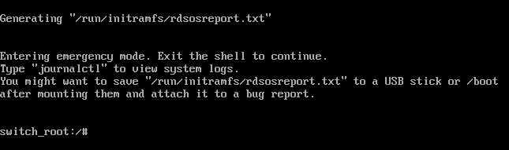

# Recover Root Password

If you have forgotten your root password, or otherwise need to recover a machine from a bad configuration (i.e a bad `/etc/fstab` entry), you can do so given you have access to the physical/virtual console. The process will be slightly different depending on which OS you're running.

## Ubuntu

First, power off your machine completely. Restart into the GRUB menu.

> **NOTE:** If you're running a VM and the GRUB menu does not come up automatically, try hitting `SHIFT` immediately after startup. This is tested to work in a KVM environment.


Once we're in the GRUB menu, press the `"e"` key to edit GRUB's parameters. We're looking for a line containing `ro quiet splash $vt_handoff`.


Replace `ro quiet splash $vt_handoff` with `rw init=/bin/bash`. This will start a bash shell at boot with our root filesystem mounted.

Finally, press `ctrl + x` to reboot system using new (temporary) parameters. You will be dumped to a shell at boot and can make any necessary changes, such as resetting the root password or otherwise repairing your machine. When you're finished, run the following command to boot normally.

```bash
exec /sbin/init
```

## RHEL

Adapted from [Red Hat's offical docs](https://www.redhat.com/sysadmin/recover-root-passwd)

Follow similar instructions as above to get to your GRUB menu, including pressing `"e"` to edit the GRUB parameters. Red Hat's parameters will look a little different that above, and there a few more steps to take. 

First, find the line that starts with `linux`, or `linux16`.


Add `rd.break` to the end of that line, and then `ctrl + x` to reboot with temporary changes. You'll be dumped to a rescue prompt that looks like this:



Remount the root partition in read/write mode so we can make changes with 

```bash
mount -o remount rw /sysroot
```

Then,

```bash
chroot /sysroot
```

At this point, you can make any necessary changes.

**BEFORE REBOOTING**, we need to ensure SELinux allows the changes we've made. Run the following:

```bash
touch /.autorelabel 
```

This will tell SELinux that the filesystem has changed and allow these changes to be loaded. This causes the whole filesystem to be relabeled which may take a while.

Finally, we can exit our `chroot`'d environment and `reboot`

```bash
exit
reboot
```
