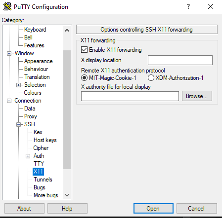

## X11 Window forwarding

Install a X11 server on your windows workstation, [Xming](https://sourceforge.net/projects/xming/) is recommended. You must start the server before using (just open Xming after install).

Use putty on your windows workstation. Check the appropriate setting when configuring the connection



You should now be able to open GUI applications remotely. Be patient, as sometimes the window will take a second to appear at first after launch.

To maintain the X11 forwarding when switching users,

```bash
xauth list ${DISPLAY#localhost}
# outputs a key to stdout

sudo su - user

# add the key that was printed before
xauth add <key>
# good to go!
```
