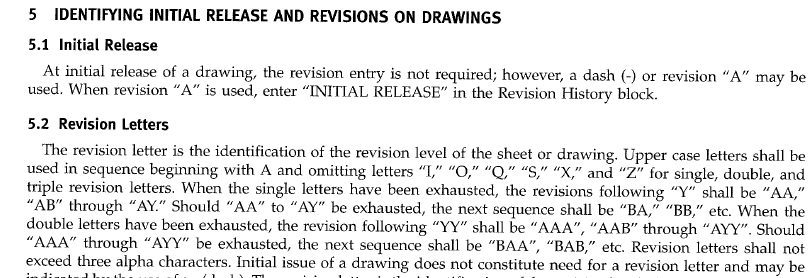

# Custom Number System

Recently, I was tasked with implementing ASME Y.14.35, a standard that defined how revision letters are incrementally chosen. An excerpt of the standard is shown below



After some discussion on how to best implement this, we decided to try to solve it using a number system with a custom set of ordinals. For example, a base 10 system with letters as ordinals could be the set "ABCDEFGHIJ".

To illustrate how this would work, consider the following python code

```python
import math

ORDS = "ABCDEFGHJK"
# ORDS = "0123456789"
_BASE = len(ORDS)


def rev2num(rev: str) -> int:
    pass


def num2rev(rev: int) -> str:
    if rev == 0:  # base case
        return ORDS[0]
    digits = math.ceil(math.log(rev + 1, _BASE))
    dn = rev
    rev = ""
    for ii in reversed(range(digits)):
        x = dn // (_BASE**ii)
        rev += ORDS[x]
        dn -= x * (_BASE**ii)
    return rev


for ii in range(0, 21):
    print(f"{ii} --> {num2rev(ii)}")
```

which outputs

```plaintext
0 --> A
1 --> B
2 --> C
3 --> D
4 --> E
5 --> F
6 --> G
7 --> H
8 --> J
9 --> K
10 --> BA
11 --> BB
12 --> BC
13 --> BD
14 --> BE
15 --> BF
16 --> BG
17 --> BH
18 --> BJ
19 --> BK
20 --> CA
```

This mirrors the base 10 system we're used to with just letters. If you wanted different bases, just change your ordinals.

## But Wait, this isn't what was required...

This was a very clever solution to a problem, but unfortunately not the problem we aimed to solve. ASME Y.14.35 called for the progression "Y" --> "AA", not "Y" -> "BA" as our code would output. This is because the standard simply isn't following the rules of a true number system, specifically having no concept of zero. If "A" was zero, then "AA" is also zero and doesn't make sense to ever be a rev number. For this reason, we were unable to use the above code to solve this problem, however I still found it interesting so I wanted to document it here.

The actual code we used is shown below for reference. It relies on string manipulation and less on math.

```python
# excerpt from Revision class
class Revision:
    ...
    # available letters, skipping I, O, Q, S, X, Z according to ASME Y14.35
    ALPHABET = ["A", "B", "C", "D", "E", "F", "G", "H", "J", "K", "L", "M", "N", "P", "R", "T", "U", "V", "W", "Y"]
    MAX_ALPHA_REVISION = "YYY"
    ...

def next_rev_letter(major: str) -> str:
    def stridxreplace(s: str, newstr: str, idx: int) -> str:
        return s[:idx] + newstr + s[idx + 1 :]

    if major == "-" or major == str(sys.maxsize):
        return "A"

    major = major.upper()

    if major == Revision.MAX_ALPHA_REVISION or len(major) > len(Revision.MAX_ALPHA_REVISION):
        raise ValueError(
            f"Maximum revision reached. Revisions above '{Revision.MAX_ALPHA_REVISION}' are not supported"
        )

    for ii in range(len(major) - 1, -1, -1):
        digit = major[ii : ii + 1]
        try:
            digit = Revision.ALPHABET[Revision.ALPHABET.index(digit) + 1]
            major = stridxreplace(major, digit, ii)
            return major
        except IndexError:
            major = stridxreplace(major, "A", ii)

    return "A" + major
```