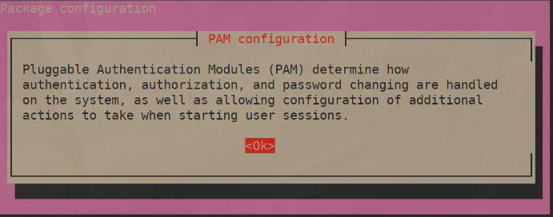
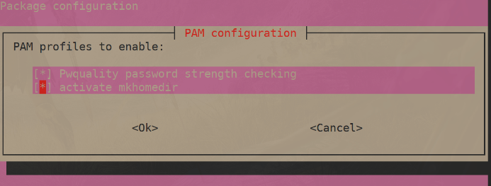
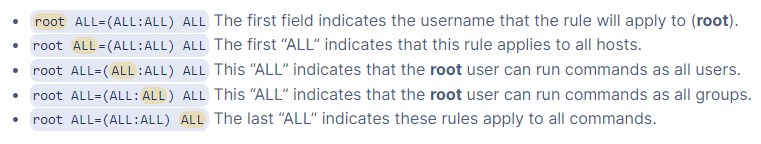

# Joining a Linux Machine to Domain

1. Install necessary packages

    ```bash
    # Fedora based (RHEL, Rocky, CentOS, etc.)
    # Note: try "subscription-manager refresh" if having issues
    sudo dnf -y install realmd sssd oddjob oddjob-mkhomedir adcli samba-common-tools krb5-workstation
    
    # Ubuntu
    # add to apt sources
    sudo tee -a /etc/apt/sources.list <<EOF
    deb http://us.archive.ubuntu.com/ubuntu/ bionic universe
    deb http://us.archive.ubuntu.com/ubuntu/ bionic-updates universe
    EOF
    # install packages
    sudo apt -y install realmd libnss-sss libpam-sss sssd sssd-tools adcli samba-common-bin oddjob oddjob-mkhomedir packagekit
    ```

2. Machine must have a unique hostname. Set with `hostnamectl` if necessary
3. Confirm that the domain is visible by `realm`

    ```bash
    sudo realm discover example.local
    ```

4. Join domain with `realm`
    - NOTE: Only an administrator of the domain can complete this step. You may want to allow root login via `ssh` in `/etc/ssh/sshd_config` for this step, giving the admin the connection details.

        ```bash
        sudo realm join -U <admin> example.local
        ```

5. For Debian based systems, we must turn on auto-create home directory.

    ```bash
    sudo bash -c "cat > /usr/share/pam-configs/mkhomedir" <<EOF
    Name: activate mkhomedir
    Default: yes
    Priority: 900
    Session-Type: Additional
    Session:
            required                        pam_mkhomedir.so umask=0022 skel=/etc/skel
    EOF
    # Activate with
    sudo pam-auth-update
    ```

    
    

6. Configure sssd to not use fully qualified names. This allows a user to login as `foo` instead of `foo@example.local`

    ```bash
    # /etc/sssd/sssd.conf
    ...
    use_fully_qualified_names = False
    ...
    # so that home directories live at /home/foo instead of /home/foo@example.local
    fallback_homedir = /home/%u
    ...
    ```

    If you've previously logged in as a user and their home directory got created with the "@" present, you need to switch them over simply by moving the contents to the new location.

    ```bash
    sudo mv /home/user@EXAMPLE.LOCAL /home/user
    ```

7. Restart `sssd` and check its status to make sure it's running

    ```bash
    sudo systemctl restart sssd
    systemctl status sssd
    ```

8. Check to see that you can id a user

    ```bash
    id username
    ```

9. Access Control
    - Even though we've joined to the domain, currently no users from the domain are allowed to login to the machine. Below are some examples on how to permit logins

        ```bash
        # permit a single user
        sudo realm permit user1
        # permit all users in a group
        sudo realm permit -g sysadmins
        # to remove a user/group, add the --withdraw flag
        sudo realm permit --withdraw user1
        sudo realm permit --withdraw -g sysadmins
        # deny all users
        sudo realm deny --all
        # permit all users (not recommended)
        sudo realm permit --all
        ```

    - to see what users are in a group, run

        ```bash
        getent group <group_name>
        ```

10. Sudo Permissions

    > **_NOTE:_** always use `visudo` when editing sudoers file. It verifies your syntax before writing to disk, saving you headaches if you mess up

    ```bash
    # /etc/sudoers.d/foo

    # permit an entire group on Debian based
    %group_name   ALL=(ALL:ALL)     ALL
    # permit an entire group on Fedora based, note the full domain
    %group_name@example.local    ALL=(ALL:ALL)      ALL
    # permit a single user
    username    ALL=(ALL:ALL)   ALL
    # no password option
    username    ALL=(ALL) NOPASSWD:ALL
    ```

    

    see [Digital Ocean](https://www.digitalocean.com/community/tutorials/how-to-edit-the-sudoers-file) for more information if needed
