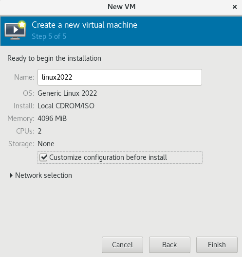
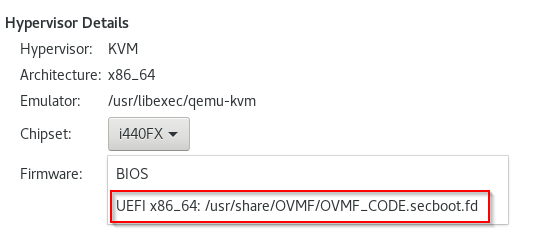

# UEFI and Secure Boot in KVM

> **WARNING!** These notes are highly experimental and were only tested on a single machine. Use caution when following these notes in the future

We can set up UEFI and secure booting in a ***new*** KVM VM. These instructions were only tested on a fresh machine and have not been tested on existing VMs.

## Set Firmware to UEFI

During the VM creation, we can select an option to "Customize configuration before install", shown below



Next, we are able to select the UEFI firmware



## Copy System "VARS" File

This section is HIGHLY experimental and I could find no good documentation to support it, though it seemed to work for me on a RHEL 8 machine acting as my hypervisor. You may be able to apply the same idea in other environments. In your VM's XML, you'll see a section like

```xml
<os>
    <type arch="x86_64" machine="pc-q35-rhel8.6.0">hvm</type>
    <loader readonly="yes" secure="yes" type="pflash">/usr/share/OVMF/OVMF_CODE.secboot.fd</loader>
    <nvram>/var/lib/libvirt/qemu/nvram/your_vm_name_VARS.fd</nvram>
</os>
```

This section describes the firmware and secure boot settings for your VM. The file `OVMF_CODE.secboot.fd` provides the UEFI firmware for the VM. OVMF stands for "Open Virtual Machine Firmware", and you can read more about it [here](http://www.linux-kvm.org/downloads/lersek/ovmf-whitepaper-c770f8c.txt). The `your_vm_name_VARS.df` file provides a "database" of sorts for the UEFI firmware to store its variables. Beyond that, my understanding is extremely limited.

What I do know, however, is that when I enabled the UEFI firmware in the KVM settings, the Secure Boot option within the UEFI settings was disabled and not available to enable. As a shot in the dark, I copied the VARS file at `/usr/share/OVMF/OVMF_VARS.secboot.fd` to the location `/var/lib/libvirt/qemu/nvram/your_vm_name_VARS.fd` specified in the VM XML.

```bash
sudo cp /usr/share/OVMF/OVMF_VARS.secboot.fd /var/lib/libvirt/qemu/nvram/your_vm_name_VARS.fd
```

After rebooting into my UEFI settings, secure boot was now enabled.

## Clear TPM

If you are using UEFI+Secure Boot with a TPM, sometimes you need to reset the TPM before it can be used again. You can do this with

```bash
sudo su - root
echo 5 > /sys/class/tpm/tpm0/ppi/request
reboot
```

During the reboot, the UEFI firmware will confirm with you whether you'd like to clear the TPM or not, and you should confirm.

If you happen to be trying built in Ubuntu TPM unlocking, you can show recovery keys with

```bash
snap recovery --show-keys
# example recovery key:
# 42985-61772-49862-42945-09212-00221-30777-22693
```

If you attempt to boot without the TPM, or from different hardware, you'll be prompted for this recovery key in order to boot. At this time, I'm not aware of a way to recover automatic unlocking with the new TPM.

TODO: move these TPM and recovery notes to a different place.
