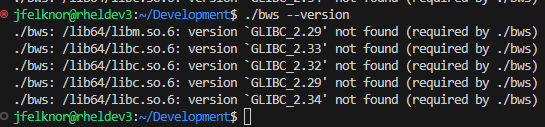

# BitWarden Secrets Manager

BitWarden offers a [secret manager service](https://bitwarden.com/help/secrets-manager-overview/) which can help developers centralize sensitive information and make changing these secrets less challenging, thus providing a greater incentive to do so.

## Case Study

Before moving to a secrets manager, the most popular way of providing secrets to your application is to use environment variables. Consider a situation where you have several different webservers, all of which need access to a few different resources. For example, it's common that a web application needs access to a relational database and an S3 object store, among potentially other things. For each resource, typically multiple pieces of information are required. Depending on your level of acceptable risk, you may have any or all of a `HOST`, `PORT`, `USER`, `PASSWORD`, and `DATABASE_NAME` as secrets. So, each one of these variables get spread out across all webservers as `.env` files.

Now, imagine you find yourself in a situation where you need to rotate these values, whether this is due to an attack or just simply a policy. You'll need to rotate all values on all hosts, in addition to changing the credentials for the databases themselves.

Contrast this to what would happen if you were using a Secrets Manager. Rotating they keys becomes as simple as changing their value in one place, with the new value being distributed automatically.

It is true that you'll still need to ship one piece of information - the access key associated with the service account - but that will add an additional process required for an attacker to figure out before gaining access to your secrets. They will not be able to see everything simply by inspecting the environment. Additionally, it becomes trivial to invalidate the access key associated with the account, blocking any additional access. Perhaps most importantly, you will no longer be leaving around all your secrets in an unencrypted at rest file `.env` for others to easily inspect.

## BitWarden Secrets CLI

The BitWarden CLI can be used to manage projects and their secrets straight from the command line.

> **NOTE:** For the most up to date version of these instructions, reference [the official documentation](https://bitwarden.com/help/secrets-manager-cli)

### Installation

To install, you have two options

#### Prebuilt Binaries

There are prebuilt binaries available on their [GitHub Releases](https://github.com/bitwarden/sdk/releases). To install, simply `wget` the appropriate release, `unzip`, and place the binary in the location of your choosing.

```bash
# current release at the time of writing
wget https://github.com/bitwarden/sdk/releases/download/bws-v0.3.1/bws-x86_64-unknown-linux-gnu-0.3.1.zip

unzip bws-x86_64-unknown-linux-gnu-0.3.1.zip

# check that the binary works
./bws --version

# Optionally, move the binary somewhere on your PATH
```

#### Compile From Source

When I was writing this documentation, the above did not work for me due the the OS I was using (RHEL 8). It had an older version of `glibc` than what was dynamically linked by the pre-built binary. This was my output:



Instead, I needed to compile `bws` from source, so that it linked against a version of `glibc` that was available on my system. Before I could do that, I needed to install `rust` tooling. You can find instructions [here](https://doc.rust-lang.org/cargo/getting-started/installation.html). At the time of writing,

```bash
curl https://sh.rustup.rs -sSf | sh
```

After installing, you can follow the instructions in the [`bws` GitHub repo](https://github.com/bitwarden/sdk/tree/master/crates/bws) for building. At the time of writing,

```bash
cargo install bws
```

which downloads the appropriate source, compiles your binary, and places it in `~/.cargo/bin/bws` which will be on your `PATH` after the `rust` tooling install.

### Configuration

If you're using a self-hosted server, you must run the following to configure your `bws` client

```bash
bws config server-base https://bitwarden.example.com
```

Then, you must create a new service account in the BitWarden web console, and give it an access token. Once you have the access token, set that environment variable in your shell.

```bash
export BWS_ACCESS_TOKEN="<your token here>"
```

Now, we can start using the CLI. It is self-documenting, and you can run `bws --help` to start exploring its options.

## Usage Within Application

There are currently no official SDKs for other languages, such as Python. In your code, you should obtain secrets by wrapping the command. For example, in python you may use,

```python
import subprocess
import json

SECRET_ID = "1234"

bws_cmd = subprocess.run(
    ['bws', 'secret', 'get', SECRET_ID],
    capture_output=True,
    text=True
)
# secret will be in stdout of the above command
secret_dict = json.loads(bws_cmd.stdout)
secret_val = secret_dict['value']
```
