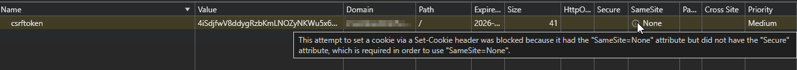

# Cookie Settings

For a more details, see the [Mozilla Documentation](https://developer.mozilla.org/en-US/docs/Web/HTTP/Headers/Set-Cookie#samesitesamesite-value). This is just to document a case study

## Case Study: SameSite and Secure Cookie Settings

Recently, when upgrading one of my applications, I ran into a interesting Cookie problem which was causing the login process to the application to fail. The application I was serving changed its default cookie settings, and the cookie was now getting the explicit `SameSite=None` policy. Before, this cookie setting was not explicitly set by the application (more on that in the resolution section). Setting `SameSite=None` indicates that the browser should send the cookie with both same-site AND cross-site requests. When this is the case, the browser also requires the cookie to have the `Secure` attribute, requiring the cookie be sent over HTTPS to help prevent Man-in-the-Middle attacks. The application appeared to also be setting this `Secure` attribute, but the client browsers weren't seeing it.

Okay.... recap for a second

### Before

1. `SameSite` property was left undefined by application
2. `Secure` attribute was not set
3. Application worked. The cookie was set appropriately

### After

1. `SameSite=None`
2. `Secure` should have been set, but wasn't
3. Browser rejected cookie because it didn't see the `Secure` attr.

### Root Cause

My first instinct was to ensure the application was configured to set the `Secure` attr. My server's reverse proxy was configured for SSL so this shouldn't have been an issue. However, after double checking the application and confirming it was trying to set the `Secure` flag, I became stuck. Why wasn't the client browser seeing it? Finally... I thought of something. Though my server was configured for SSL, there was a second reverse proxy at the container level, handling the application specific routing that only operated on HTTP. This is a common pattern that I use, separating the concerns of application specific logic and SSL termination that the server handles (allows me to run multiple SSL containerized applications on a single IP on a single server). Though the HTTP was only happening on the loopback interface, I believe this layer of reverse proxy was stripping the `Secure` attribute on the cookie.

### Resolution

In my environment, changing the way I handled my several layers of reverse proxy was pretty much a non-starter (unless there is a strategy that I do not know of which lets me do server name routing without terminating SSL). Instead, I aimed to restore the Cookie policies the application was using before.

I discovered in the [Mozilla Documentation](https://developer.mozilla.org/en-US/docs/Web/HTTP/Headers/Set-Cookie#samesitesamesite-value) that browsers typically assume `SameSite=Lax` on a cookie where it isn't explicitly set (my situation!). This meant to simply restore how the application was working before, I changed the `SameSite` cookie setting within the application to `Lax`. This means the cookie is not sent on cross-site requests, such as on requests to load images or frames, but is sent when a user is navigating to the origin site from an external site (i.e. when following a link).

After making this change, my application worked as it did before.
